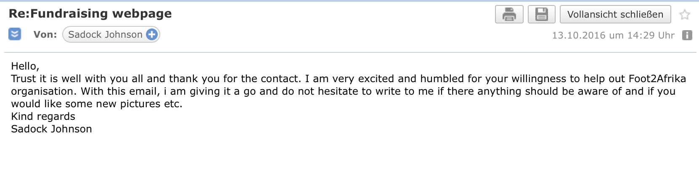
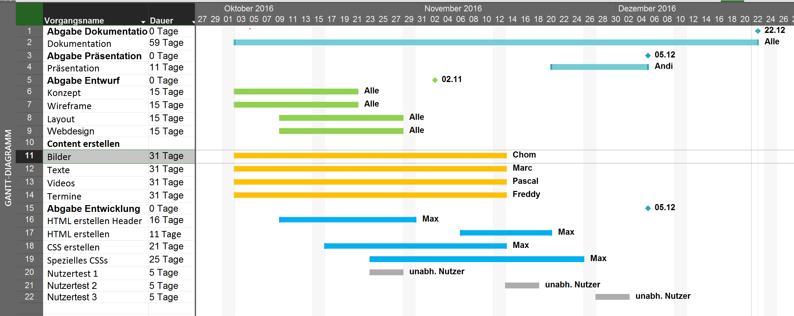

:shipit:
# DHBW-Heidenheim / Webprojekt / Foot2Afrika / Gruppe A3

[Foot to Afrika - Fundraising Tour Deutschland](http://www.wwi16a3.projekt.dhbw-heidenheim.de/)

#  I	Projektdokumentation	

## Inhaltsverzeichnis

###   1	Vorstellung des Webprojekts	

####  1.1	Projektbeschreibung	
####  1.2	Projektumfang		


###   2	Ablauf des Projekts

#### 2.1	Projektplan und Planung	
#### 2.2	Informationsbeschaffung	
#### 2.3	Übersetzung und Verarbeitung der Ausgangstexte


### 3	Inhalt	

#### 3.1	Auswahl der Themen
#### 3.2	Fundraising Tour
#### 3.3	Was ist Foot2Afrika
#### 3.4	Termine	
#### 3.5	FAQ	


### 4	Erstellung	

#### 4.1	Hitergrund und Sinn der Webseite	
#### 4.2	Verwendete Technologien	
##### 4.2.1	Software	
##### 4.2.2	HTML5	
##### 4.2.3	CSS3	
#### 4.3	Browser
#### 4.4 Design
	          
### 5	Anlagen	
#### 5.1 Genehmigung für die Rechte der Bilder
#### 5.2 Projektplan
#### 5.3 Wireframes


###   1.  Vorstellung des Webprojekts
####  1.1 Projektbeschreibung

Die Aufgabe in diesem Projekt ist es, sich in einer Gruppenarbeit mit der Erstellung einer statischen Website auseinanderzusetzen. 
Inhaltlich befasst sich unsere Website mit der Foot2Afrika Fundraising Tour, die jährlich in Deutschland stattfindet, um einerseits Spenden zu sammeln und andererseits über die Situation in Tansania aufmerksam zu machen.
Mit der Website möchten wir Interessenten eine schnelle, kurze, aber ausreichende Übersicht über das Thema Fundraising bieten. Außerdem findet man alle anstehende Tour Termine in unserem Kalender. 
Neben der Fundraising Tour möchten wir ebenfalls die hinter der Veranstaltung steckende Organisation „Foot2Afrika“ und ihre Arbeit vorstellen.
Sollten trotzdem Unklarheiten auftreten, bietet unsere FAQ eine Reihe von oft gestellten Fragen und ihre Antworten dazu. Außerdem ist es dem User möglich durch das Kontaktformular sein Anliegen zu senden.
Nach Abschluss des Projekts soll die Website auch für weitere darauffolgende Touren in den kommenden Jahren Informationen zu den Terminen bieten.

####  1.2 Projektumfang

Bei der Erstellung einer statischen Website muss berücksichtig werden, dass diese mindestens vier unterscheidbare, bedeutsame und gehaltvolle Seiten beinhalten soll. 
Zuvor muss sowohl ein Projektplan, als auch verschiedene Wireframes eingereicht werden.
Unsere Arbeit soll darüber hinaus „responsive“ sein. Damit ist gemeint, dass die Website auf verschiedene Browser und Geräten, wie zum Beispiel Mobiltelefone und Tablets, funktionieren soll.

###   2. Ablauf des Projekts

####  2.1 Projektplan und Planung

Zu Beginn des Webprojekts war die Erstellung unseres Projektplans eins der wichtigsten Schritte in unserer  Vorgehensweise. Der Plan beinhaltete wichtige Punkte und Aufgaben für das Projekt, und noch wichtiger die Abgabefristen. Dadurch hatte jeder in der Gruppe eine allgemeine Übersicht über die anstehende Arbeit. Es war uns ebenfalls wichtig, dass jeder die Zeit im Überblick hatte, weshalb wir die Aufgabenverteilung schnell getroffen haben. Somit konnte ein Teil der Gruppe sich bereits der ersten Aufgabe widmen, die Erstellung der Wireframes, während der anderer Teil sich um den Inhalt bemüht hat. Dadurch wollten wir bezwecken, dass keine Zeit verloren ging und man parallel arbeiten konnte. Dies ersparte uns eine Menge Mühe und man verhinderte dadurch Doppelarbeiten.
Den Projektplan ist im [Anhang](pm/Projektplan.PNG) zu finden.

Des Weiteren spielte die optische Strukturierung unserer Website, neben der allgemeinen Projektplanung, eine weitere große Rolle. Mit Hilfe der Wireframes haben wir erste Ideen gestalterisch umgesetzt und festgehalten, ohne dass man jegliche Kenntnisse über das HTML oder CSS besitzen muss. Weshalb die Wireframes in unseren Augen ein sehr hilfreicher Einstieg für jeden Anfänger sind, die sich mit der Erstellung einer Website auseinander setzen möchten. Die Wireframes haben eine Art wegweisende Funktion, wie z.B ein roter Faden, an dem man sich orientieren kann. Sie beinhalten den definierten Projektumfang und wichtige Punkte, die zu berücksichtigen sind. Dadurch hatte man ebenfalls einen Überblick über die Konstruktion gehabt.
Des Weiteren haben wir für die Übersicht ein Storyboard und den grafischen Aufbau der Websitenstruktur erstellt.
Diese sind im ebenfalls im [Anhang](pm/wireframes/) zu finden.

####  2.2 Informationsbeschaffung

Parallel zu all den optischen Strukturierungen haben wir uns auch um den Inhalt bemüht. Für das Thema "Fundraising Tour" haben wir uns mit den Veranstaltern und Organisation "Foot2Afrika", die in Tansania ihren Sitz hat, in Verbindung gesetzt und um Nutzungserlaubnis für Texte und Bilder gebeten. Außerdem wurden weitere Bilder von Creative Common entnommen und verwendet.
Eine Kopie der Erlaubnis in Email-Form ist im [Anhang](Email Foot2Africa.png) zu finden.

####  2.3 Übersetzung und Verarbeitung der Ausgangstexte

Da die inhaltliche Grundlage unserer Website auf der englischsprachigen Foot2Afrika-Website beruht, mussten alle Informationen für unsere Besucher in die deutsche Sprache übersetzt werden. Mit Hilfe von Online-Wörterbücher, wie z.B Leo, und eigenen Sprachkenntnissen haben wir wichtige Inhalte gefiltert und so gekürzt, dass sie informativ und übersichtlich waren

###   3.  Inhalt
####  3.1 Auswahl der Themen

Unser Hauptaugenmerk lag darauf, einen kurzen Überblick über Foot2Afrika zu geben, mit dem Hauptfokus jedoch auf der Fundraising Tour, wie es die Aufgabenstellung verlangte. Um nicht nur die Info-Seiten von Foot2 Afrika zu kopieren, haben wir die, für den Besucher der Website, wichtigsten Informationen extrahiert und versucht, diese möglichst Übersichtlich und prägnant auf unserer Website darzustellen. Da das Verhalten von Usern gezeigt hat, dass diese lange Texte auf Websites nicht lesen, sondern nur überfliegen bzw. nach Key-Wörtern suchen, wollten wir durch kurze Inhaltsvolle Texte dem entgegenwirken und den Besucher unserer Website dazu bringen, möglichst viele für ihn nützliche Informationen herauszufinden.

####  3.2 Fundraising Tour

Die Fundraisingtour besteht aus mehreren Veranstaltungen, mit dem Ziel die Organisation Foot2Africa den Menschen näher zu bringen und Fragen zu beantworten.
Es finden verschiedene Events statt, Beispiele dafür sind z.B. ein gemeinsames kochen, Vorträge und noch mehr.

####  3.3 Was ist Foot2Afrika

Foot2Africa ist eine Organisation mit dem Ziel, die Armut in Tansania zu bekämpfen. Es werden verschiedene Projekte gefördert, um unter anderem, jedem Menschen den Zugang zu Wasser und zu Bildung zu gewähren.

####  3.5 Termine 

Die Termine der Fundraisingtour wurden uns durch ein Google Dokument zur Verfügung gestellt. Da die privaten Termine für uns unrelevant waren, haben wir uns entschieden diese auszusortieren und ausschließlich die öffentlichen Termine auf der Website zu veröffentlichen.

####  3.6 FAQ

Um Fragen für die FAQ-Seite zu finden, wurden potentielle Nutzer befragt. Die gestellten Fragen wurden teils umformuliert und anschließend übernommen.
Bei späteren Tests stellte sich heraus, dass die getesteten User keine weiteren Fragen hatten.

###   4.    Erstellung
####  4.1   Hintergrund und Sinn der Website

Ziel der Website ist es, die Fundraising-Tour von der Organisation "Foot2Afrika", die jährlich in Deutschland veranstaltet wird, vorzustellen und dem Besucher näherzubringen. Man wird allgemein über das Fundraising informiert und erhält zu dieser Tour die anstehende Termine. Die Besucher sollen leicht durch den Inhalt geführt werden, sodass Interesse aufkommt sich zu engageren und teilzunehmen. Außerdem informiert unsere Website über die Veranstalter "Foot2Afrika" selbst. 

Damit auch ein Überblick über Foot2Afrika für nicht englischsprachige Personen vorliegt, haben wir auf unserer Website die wichtigsten Informationen und Ziele von Foot2Afrika und ihrer Fundraising Tour möglichst übersichtlich dargestellt. Wir haben uns hierbei auf die wichtigsten Informationen konzentriert, um nicht eine zweite deutschsprache Foot2Afrika Website zu erstellen, sondern eine Website bei der die Fundraising Tour im Vordergrund steht.

####  4.2   Verwendete Technologien
##### 4.2.1 Softwareliste

- Github
- FilaZilla (FTP-Programm)
- JADE  (HTML-Compiler)
- SASS  (Syntactically Awesome Stylesheets)
- WebStorm  (HTML/CSS Editor)
- Brackets  (HTML/CSS Editor)

**Verwende Software/Programme:**

- [Github](https://github.com/)

Der Dienstleister Github dient der Verwaltung von quelloffener Software (engl. ‚open source hoster‘). Github bietet die Möglichkeit mit mehreren Entwicklern an einem Projekt (‚Repositorie‘) zu arbeiten. Mit dieser Möglichkeit erleichterte uns Github unsere Zusammenarbeit, an den HTML Files, CSS Stylesheets, aber beispielsweise auch an der Userstory. Völlig gleich, wann an einer Datei von einem unserer Teammitglieder eine Änderung vorgenommen wurde, durch eine kurze Synchronisation auf Github waren alle anderen sofort auf dem neusten Stand. Vergleichsweise einfach war das Zusammenarbeiten mehrerer Teammitglieder an einem CSS-Stylesheet. Dadurch, dass alle stets auf dem gleichen Stand waren und alle gemeinsamen Dateien über Github beziehen konnten, konnten auch schnell Verbesserungen angebracht oder Fehler eliminiert werden.
Abschließend kann man festhalten, dass uns Github die Zusammenarbeit an unserem Webprojekt enorm erleichtert hat. Anstatt permanent Dateien von A nach B zu senden und überwachen zu müssen, welche Datei nun die aktuellste ist, kann man sich bei Github einloggen und hat immer einen guten Überblick über den Stand des Webprojekts.

- [Brackets](http://brackets.io/)

Brackets ist ein kostenloser, open-source Texteditor. Er erlaubt es, beliebige Anwendungen mit JavaScript, HTML und CSS zu erstellen, ist aber am ehesten zum Erstellen von Webprojekten gedacht. Mit der integrierten Live-Ansicht weiterer optionaler Features ermöglicht der Editor eine optimale Arbeit mit dem HTML und CSS Code.

- [Balsamiq Mockups](https://balsamiq.com/products/mockups/)

Zur Erstellung der Skizzen/Wireframes für die verschiedenen Ansichten unserer Webseite haben wir das Wireframing10-Tool Balsamiq Mockups verwendet. Die Benutzeroberfläche des Tools stellt eine Auswahl an vorgefertigten geometrischen Objekten, verschiedenen UI-Elementen und weiteren Formen zur Verfügung. Diese können ganz einfach per Drag-and-Drop auf dem virtuellen Skizzenpapier zurechtgerückt werden. In dem Tool haben wir alle nötigen Elemente, von Navigationen bis hin zu Formularen, gefunden. Diese haben wir dann unseren Vorstellungen entsprechend angeordnet und so die Skizzen für unsere frühe Konzeptphase entwickelt. 
Die Konzeption selbst, also Fragen wie: „Sollen die Bilder in der mobilen Ansicht untereinander oder passen auch zwei nebeneinander?“, kann einem das Toll natürlich nicht abnehmen. Allerdings veranschaulichen einem die, in Balsamiq Mockups erstellten, Wireframes sehr gut verschiedene Möglichkeiten und helfen so doch ein gutes Konzept aufzustellen.
Außerdem Positiv: Das Tool kann bis zu 30 Tagen kostenfrei verwendet werden, danach kostet es allerdings.

- [StoriesOnBoard](http://storiesonboard.com/)	

Zur Ausarbeitung unserer Userstories haben wir das Online und Cloudbasierte Tool StoriesOnBoard verwendet. Dieses bietet die Möglichkeit per Drag-and-Drop, verschiedenfarbige Karteikarten anzuordnen und somit verschiedene Ebenen der Userstory dazustellen. 
Des Weiteren sollte an dieser Stelle die Webseite von [Roman Pichler](http://www.romanpichler.com/blog/10-tips-writing-good-user-stories/) erwähnt werden, die uns beim Grundverständnis des Themas Userstory und bei der anschließenden Ausarbeitung eine große Hilfe war.

- [Sass (Syntactically Awesome Stylesheets)](http://sass-lang.com/)

Sass [„ist eine Stylesheet-Sprache, die als Präprozessor die Erzeugung von Cascading Style Sheets erleichtert.“](https://de.wikipedia.org/wiki/Sass_(Stylesheet-Sprache))
Aus einer erstellten SASS Datei wird also Bevor diese auf dem eigentlichen Server zum Einsatz kommt, eine CSS Datei. SASS ermöglicht es den Code schneller, einfacher, effektiver und besser zu erstellen und anschließend pflegen zu können. Als Ergebnis erhält man also (im Normalfall) eine sehr saubere CSS Datei. 
Ein weiterer erwähnenswerter Punkt ist, dass man mit SASS rechnen kann. Als kleines Beispiel: Jede H1 Überschrift, soll 3-mal so groß sein wie die Standart-Schriftgröße. Mit SASS kein Problem.

- [WebStorm](https://www.jetbrains.com/webstorm/)
..für Studenten zum Glück kostenlos, ist eine Entwicklungsumgebung für JavaScript und HTML. Sie unterstützt natürlich Syntax-Highlighting, IntelliSense und Autocomplete. Außerdem bietet sie ein Browser-Plugin, der das Debuggen im Browser erleichtert.

- [Jade](https://www.jadeworld.com/developer-center/)

Jade ähnelt in gewisser Weise SASS. Nur das es hier nicht darum geht das coden von CSS sondern von HTML zu erleichtern. Ein riesen Vorteil ist, dass HTML-Elemente nie wieder falsch geschlossen werden. 
Da die Beschreibung sehr umständlich wäre hier noch ein kleines Zitat:
„Die richtige Einrückung der jeweiligen HTML-Elemente passiert über Tab-Stopps innerhalb von Jade. Ihr könnt so ganze HTML-Konstrukte mit nur sehr wenigen Keywords beschreiben. Darüber hinaus wird HTML durch Jade unter anderem mit Logik erweitert: Schleifen, Vererbung, Mixins und Variablen stehen zur Verfügung, um den HTML-Workflow zu optimieren.“ (http://t3n.de/news/jade-638027/)

- [FileZilla (FTP-Programm)](https://filezilla-project.org/)
Den open-source - FTP-Client FileZilla haben wir zum hochladen unserer Seite auf den Server verwendet. Dank der einfachen Bedienbarkeit und Funktionalität wird einem genau das nämlich von FileZilla erleichtert. 


##### 4.2.2 HTML

Bei der Erstellung der benötigten HTML-Files für die Webseite haben wir die Semantik des aktuellen Standards HTML 5 eingehalten. Während und nach der Erstellung besagter Files haben wir diese mithilfe des [W3C Markup Validator](https://validator.w3.org/) überprüft um zu gewährleisten, dass wir qualiltativ hochwertiges und vor allem richtiges HTML verwenden.
##### 4.2.3 CSS

**Struktur/Aufbau**

Unser CSS-Files sind nach Modulen/Bereichen jeweils so aufgeteilt, dass jeder Teilbereich dadurch ein eigenes CSS-File erhält. Dies hat den Vorteil, dass die Fehlersuche und die Wartung des Codes erleichtert werden, da nur im entsprechenden Teilsegment gesucht werden muss.

Damit im HEAD der HTML-Files nicht immer alle CSS-Files eingebunden werden müssen und dadurch die Übersicht leidet, wurden alle Modul-CSS-Files in ein einziges Stylesheet importiert. Somit musste immer nur das `stylesheet.css` im HEAD eingebunden werden.

Durch die modulare Aufbauweise der CSS-Files konnte in den CSS-Files weitesgehends auf Kommentare verzichtet werden, dennoch sind komplizierte Anweisungen trotzdem kommentiert.

Diese findet man im Anhang...

```
stylesheet.css
├── basic-stylesheet.css
├── desktop-navigation.css
├── faq.css
├── fluidgrid.css
├── footer.css
├── form.css
├── formular.css
├── kalender-picker.css
├── mobile-navigation.css
├── overrides.css
├── print.css
├── slide-show.css
├── spenden.css
├── tablet-navigation.css
└── tour-event.css
```

##### 4.3   Browser

Da gleiche Quellcodes von unterschiedlichen Browsern nicht gleich interpretiert und dargestellt werden war es auch eine Aufgabe für uns stets zu überwachen, ob unsere Website auf allen Browsern richtig dargestellt wird. Wir haben uns hierbei auf die geläufigsten Browser konzentriert: Mozilla Firefox, Microsoft Edge, Google Chrome und Safari. Aufgrund der stark abnehmenden Verwendung und der enormen bekannten Problematiken haben wir uns dafür entschieden, für den Internet Explorer keine speziellen Anpassungen vorzunehmen.

##### 4.4   Design

Das Design der Website ist weitesgehend an der Vorlage von [Foot2afrika](http://www.foot2afrika.com/) ausgerichtet. Ebenfalls haben wir die Farbauswahl so getroffen, dass diese dem Logo ähnelt. Dadurch möchten wir erreichen, dass der User die Zugehörigkeit der Fundraising Tour zu Foot2Afrika erkennt. Außerdem erzeugen wir dadurch eine Einheitlichkeit und trennen uns nicht willkürlich ab, da unsere Website ebenfalls eine unterstützende Funktion haben soll.
Jedoch möchten wir nicht den Eindruck vermitteln, dass das Design lediglich übernommen oder sogar kopiert wurde und haben uns z.B beim Footer gegen das Design von [Foot2afrika](http://www.foot2afrika.com/) entschieden und unsere eigene Kreation verwendet. 
Des Weiteren hebt sich das Design des Kalenders ebenfalls ab. Es sollte nicht an einen gewöhnlichen Kalender erinnern, wie man ihn aus Outlook oder ähnlichen Terminplaungsassistenten kennt, sondern eher an "Produkte" die mit den Bildern und dazugehöringen Texten Leben bekommen und Intresse zum Lesen wecken. Die Termine sollte auch alle Informationen die uns gegeben waren Abdecken können.

Allgemein zusammengefasst haben wir uns für eine einheitliche, schlichte, aber stilvolle Gestaltung entschieden. Da es für uns wichtig war, dass die Besucher der Website primär den Inhalt vermittelt bekommen. Trotzdem war es uns bewusst, dass es auch zugleich eine "langweilige" Wirkung haben könnte und es für manche zu "trocken" sein könnte. Weshalb wir unsere Mühe in die Hauptseite investiert haben.
Die Startseite hebt sich eindeutig durch ihre Dynamik ab und vermittelt dadurch eine willkommende Funktion für den Besucher.
Ziel des Design bei diesen Objekten war es dem Anwender der Seite Spaß und einen Überaschungsmoment zu liefern. 


##### 4.5  User-Testing bzw. Usability-Tests:

Zwei Mal während der Projektlaufzeit, haben wir unsere Seite ein wenig testen lassen. 
Eigentlich wollten wir drei „Tests“ machen, den ersten nur anhand unserer Wireframes, aber wie es manchmal so ist mit der Planung, ist aus diesem ersten frühen Test nichts geworden.
Den ersten Test haben wir gemacht, als das „Grundgerüst“ unserer Seite stand. Hier ging es uns vorwiegend darum, ob die Testpersonen ganz grundsätzlich mit der Seite klarkommen und sich gut orientieren können. 
Beim zweiten Test war die Webseite schon fertig, bis auf die eine oder andere Seite die nicht mit dem richtigen Content gefüllt war. Hier wurde das testen dann etwas spannender, würde den Usern unsere fertige Seite gefallen? Würden Ihnen Fehler oder Bugs auffallen von denen wir bereits wussten? Oder würden Sie sogar neue Fehler entdecken? Mit genau diesen Fragen, saßen wir neben 10 Freunden, die am PC, Laptop, Handy und Tablet getestet haben.
Sehr zu unserer Freude, waren alle total begeistert von unserer Website. Es gab kleinere Kritikpunkte, zum Beispiel waren nicht alle gleich begeistert von der Präsentation unserer Bilder. Des Weiteren tat sich wie aus dem nichts ein etwas größerer Bug in der Navigationsleite auf. 
Abschließend kann man sagen, dass wir doch sehr von den Usability-Tests profitiert haben. Steckt man selbst mitten im Projekt kann man selbst mit 12 Augen manchmal nicht erkennen, was „User“ sofort entdeckt.

### 5. Anhang
#### 5.1 Genehmigung für die Rechte der Bilder


#### 5.2 Projektplan


#### 5.3 Wireframes
Die Wireframes befinden sich in folgendem Ordner:
[Wireframes](pm/wireframes/)
